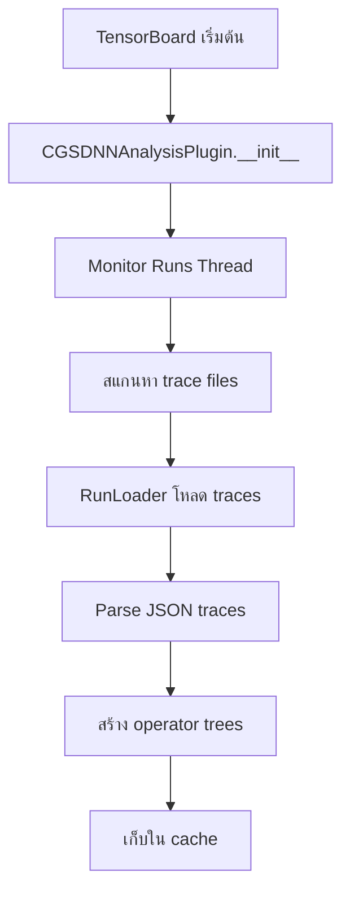
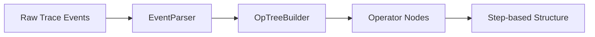

# CGS-DNN Analysis: คู่มืออธิบายโค้ดและ Flow ของโปรเจค

## ภาพรวมของโปรเจค (Project Overview)
CGS-DNN Analysis (Computational Graph System for Deep Neural Network Analysis) เป็น TensorBoard plugin ที่ออกแบบมาเพื่อวิเคราะห์และแสดงผล profiling data จาก PyTorch โดยเฉพาะอย่างยิ่งสำหรับ distributed training ที่มีการสื่อสารระหว่าง nodes/GPUs

**วัตถุประสงค์หลัก:**
*   แสดงผล operator tree และ execution timeline
*   วิเคราะห์ communication patterns (broadcast, all-reduce)
*   เปรียบเทียบ performance ระหว่าง algorithms ต่างๆ
*   แสดง DAG (Directed Acyclic Graph) ของ computation และ communication

## โครงสร้างโปรเจค (Project Structure)
```
cgs_dnn_analysis/
├── __init__.py          # Entry point, version info
├── plugin.py            # TensorBoard plugin หลัก
├── run.py               # Data models สำหรับ runs และ profiles
├── consts.py            # Constants และ configurations
├── debug_operations.py  # Debug utilities สำหรับ operations
├── multiprocessing.py   # Multiprocessing utilities
├── utils.py             # General utilities
├── profiler/            # โมดูลสำหรับ parse profiling data
├── io/                  # File I/O และ caching
└── static/              # Frontend (HTML/JS)
```

## Flow การทำงานหลัก (Main Workflow)

### 1. การโหลดข้อมูล (Data Loading)


**1.1 Plugin Initialization**
*   `plugin.py:__init__()` สร้าง plugin instance
*   เริ่ม 2 background threads:
    *   `_monitor_runs`: สแกนหา trace files ใหม่
    *   `_receive_runs`: รับและประมวลผล runs

**1.2 Trace File Discovery**
*   `plugin.py:_monitor_runs()` สแกน logdir ทุก 10 วินาที
*   ค้นหาไฟล์ที่ match pattern: `*.pt.trace.json` หรือ `*.pt.trace.json.gz`
*   สร้าง thread ใหม่สำหรับโหลดแต่ละ run

**1.3 Data Loading และ Parsing**
*   `profiler/loader.py:RunLoader` โหลด trace files
*   `profiler/data.py:RunProfileData` parse JSON traces
*   สร้าง operator tree จาก trace events

### 2. การประมวลผล Operator Trees


**2.1 Event Parsing**
*   `profiler/event_parser.py:EventParser` แปลง events เป็น nodes
*   จัดกลุ่ม events ตาม thread ID (TID)
*   สร้าง hierarchy ของ operations

**2.2 Tree Building**
*   `profiler/op_tree.py:OpTreeBuilder` สร้าง operator tree
*   แยก operations ตาม `ProfilerStep`
*   จัดการ forward/backward relationships

**2.3 Data Collection**
*   `run.py:StepDataCollector` รวบรวม operations ตาม step
*   แยกประเภท: forward, loss, backward, optimizer
*   จับคู่ communication operations (broadcast, all-reduce)

### 3. API Endpoints
Plugin ให้บริการผ่าน HTTP endpoints:

**3.1 `/runs` - รายชื่อ runs**
```json
# plugin.py:runs_route()
{
    "runs": ["run1", "run2", ...],
    "loading": false
}
```

**3.2 `/workers` - รายชื่อ workers ใน run**
```
# plugin.py:workers_route()
["worker1", "worker2", ...]
```

**3.3 `/runtime` - Operator tree data**
```json
# plugin.py:runtime_route()
{
    "1": {
        "forward": {...},
        "loss": {...},
        "backward": [...],
        "optimizer": {...},
        "broadcasts": [...]
    }
}
```

**3.4 `/dag` - DAG visualization data**
```json
# plugin.py:dag_route()
{
    "1": {
        "nodes": [
            {
                "id": "comp_1",
                "label": "Conv2d",
                "category": "computation",
                "lane": "top",
                "dur": 2.5
            }
        ],
        "edges": [
            {
                "source": "comp_1",
                "target": "comp_2",
                "kind": "seq"
            }
        ]
    }
}
```

**3.5 `/communication_timing` - เปรียบเทียบ timing**
```json
# plugin.py:communication_timing_route()
{
    "Ring": {
        "broadcast_0": 0.0123,
        "all_reduce_0": 0.0456
    },
    "Tree": {...}
}
```

### 4. Frontend Visualization
Frontend ใช้ D3.js สำหรับ visualization:

**4.1 Views ที่มี:**
*   **Runtime View:** Timeline แสดง operations บน 2 lanes
    *   **Computation lane:** forward, loss, backward, optimizer
    *   **Communication lane:** broadcast, all-reduce
*   **DAG View:** Graph แสดงความสัมพันธ์
    *   **Nodes:** operations (ขนาดตาม duration)
    *   **Edges:** dependencies และ data flow
*   **Communication Timing Table:** เปรียบเทียบ algorithms

**4.2 Features:**
*   Zoom และ pan สำหรับดูรายละเอียด
*   Tooltips แสดงข้อมูล timing
*   Responsive design
*   Label visibility ตาม zoom level

## การประมวลผล Operations (Operations Processing)

**1. การจัดกลุ่ม Operations**
`debug_operations.py:StepDataCollector` จัดการ:
```python
# แยกตาม operation type
operations = {
    'forward': 'nn.Module: DistributedDataParallel_0',
    'loss': 'aten::cross_entropy_loss',
    'backward': 'nn.Module: DistributedDataParallel_0.backward',
    'optimizer': 'Optimizer.step#SGD.step',
    'broadcast': 'nccl:broadcast',
    'allreduce': 'nccl:all_reduce'
}
```

**2. การจับคู่ Communication Operations**
Communication operations ถูกจับคู่กับ computation ผ่าน `external_id`:
```python
# จับคู่ broadcast กับ forward operation
if current.get('external_id') == external_id:
    step_data['broadcasts'].append(broadcast_op)

# จับคู่ all_reduce กับ backward operation
if node.get('external_id') == external_id:
    # แทนที่ placeholder ด้วยข้อมูลจริง
    node.update(all_reduce_data)
```

**3. การ Normalize เวลา**
เวลาถูก normalize เป็น scale 0-10 สำหรับแต่ละ step:
```python
# plugin.py:normalize_within_step()
scale = 10.0 / (max_time - min_time)
normalized_time = (time - min_time) * scale
```

## Data Models

**1. Run และ RunProfile**
```python
class Run:
    - name: ชื่อ run
    - run_dir: directory path
    - profiles: dict ของ worker profiles

class RunProfile:
    - worker: ชื่อ worker
    - span: time span
    - tid2tree: operator trees ตาม thread ID
```

**2. Operator Nodes**
```python
class OperatorNode:
    - name: ชื่อ operation
    - type: ประเภท (e.g., 'aten::conv2d')
    - children: list ของ child operations
    - start_time: เวลาเริ่ม
    - end_time: เวลาสิ้นสุด
    - external_id: ID สำหรับจับคู่ communication
```

## การ Cache และ Performance

**1. Caching Strategy**
*   Operator trees ถูก cache ใน memory (`_operator_trees`)
*   Communication timing ถูก cache (`commTimingCache`)
*   ลด repeated parsing และ computation

**2. Multiprocessing**
*   ใช้ `spawn` method สำหรับ multiprocessing
*   แต่ละ run โหลดใน thread แยก
*   ไม่ block UI ระหว่างโหลด

## การติดตั้งและใช้งาน

**1. Installation**
```bash
pip install -e .
```

**2. การใช้งานกับ TensorBoard**
```bash
tensorboard --logdir=./log --load_fast=false
```

**3. การสร้าง Trace Files**
ใช้ PyTorch Profiler:
```python
with torch.profiler.profile(
    activities=[ProfilerActivity.CPU, ProfilerActivity.CUDA],
    on_trace_ready=torch.profiler.tensorboard_trace_handler('./log')
) as prof:
    # training code
    prof.step()
```

## ข้อควรระวังและ Best Practices
*   **Memory Usage:** Trace files ขนาดใหญ่อาจใช้ memory มาก
*   **File Naming:** ต้องตาม pattern `*.pt.trace.json`
*   **Step Synchronization:** ต้องมี `ProfilerStep` markers
*   **Communication Tracking:** ต้องมี `external_id` สำหรับจับคู่

## การ Debug และ Troubleshooting

**1. Debug Operations**
ใช้ `debug_operations.py`:
```bash
debug_operations_data(input_file, output_file)
```

**2. Log Levels**
ตั้งค่าผ่าน environment variable:
```bash
export TORCH_PROFILER_LOG_LEVEL=DEBUG
```

**3. Common Issues**
*   ไม่เจอ traces: ตรวจสอบ file pattern และ path
*   Memory overflow: ลด trace duration หรือ sampling rate
*   Missing operations: ตรวจสอบ profiler configuration

## สรุป
CGS-DNN Analysis เป็นเครื่องมือที่ powerful สำหรับวิเคราะห์ distributed DNN training โดย:
*   แสดง execution timeline แบบ interactive
*   วิเคราะห์ communication overhead
*   เปรียบเทียบ algorithms ต่างๆ
*   ช่วยระบุ bottlenecks และ optimization opportunities

Plugin นี้ integrate กับ TensorBoard อย่างลงตัว และให้ insights ที่ลึกซึ้งเกี่ยวกับ training performance โดยเฉพาะในระบบ multi-GPU/multi-node.
