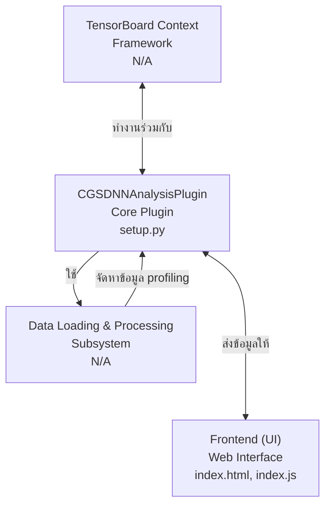
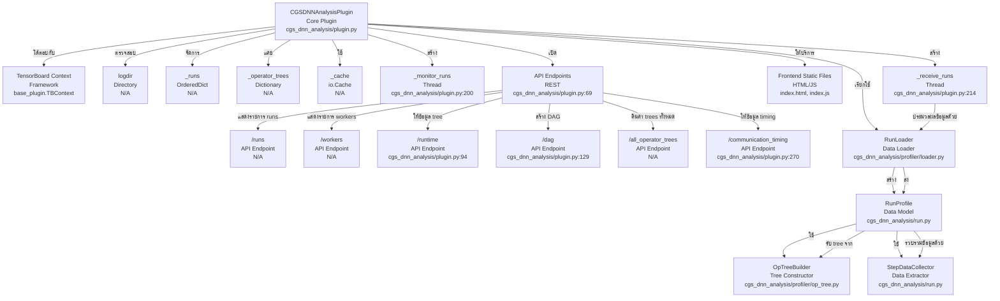

# เอกสารประกอบโค้ดเบส CGS-DNN Analysis Plugin
เอกสารนี้ให้ภาพรวมที่ครอบคลุมของโค้ดเบส `tensorboard-plugin-cgs-dnn-analysis` ซึ่งเป็นปลั๊กอิน profiler แบบ minimalist ที่ออกแบบมาเพื่อแสดงและวิเคราะห์ operator trees ภายใน TensorBoard

## สถาปัตยกรรมระดับสูง (High-Level Architecture)

ปลั๊กอิน CGS-DNN Analysis (`setup.py`) ทำงานร่วมกับ TensorBoard เพื่อแสดงผลและวิเคราะห์ข้อมูล profiling ของโครงข่ายประสาทเทียมเชิงลึก (DNN) โดยเน้นไปที่ operator trees และลักษณะการทำงานของมันโดยเฉพาะ ระบบทำงานโดยการโหลดข้อมูล profiling ดิบ (รูปแบบ Chrome Trace), ประมวลผลเป็น operator trees ที่มีโครงสร้าง จากนั้นส่งข้อมูลนี้ไปยัง frontend บนเว็บเพื่อการแสดงผลแบบโต้ตอบ

ส่วนประกอบหลักและความสัมพันธ์มีดังนี้:

**CGSDNNAnalysisPlugin**: ปลั๊กอินหลักของ TensorBoard ที่รับผิดชอบการจัดการวงจรชีวิตของข้อมูล profiling, การโหลดข้อมูล, การแคช, และการเปิด API endpoints สำหรับ frontend
**Data Loading & Processing Subsystem**: ระบบแบบ multi-threaded/multi-process ที่ค้นหา profiling runs ใหม่, โหลดไฟล์ trace ดิบ, และแปลงเป็น `RunProfile` ที่มีโครงสร้างและจากนั้นเป็น operator trees
**Frontend (Static Assets)**: ส่วนติดต่อผู้ใช้บนเว็บที่สร้างด้วย HTML และ JavaScript ซึ่งใช้ข้อมูลจาก API endpoints ของปลั๊กอินเพื่อแสดงผล operator trees และ DAG การทำงาน

```
+---------------------+       +-------------------------+       +-------------------+
| TensorBoard Context | <---> | CGSDNNAnalysisPlugin    | <---> | Frontend (UI)     |
+---------------------+       |                         |       | (index.html,      |
                               | - Monitors logdir       |       |  index.js)        |
                               | - Manages Run objects   |       +-------------------+
                               | - Caches operator trees |
                               | - Exposes API Endpoints |
                               +-----------^-------------+
                                           |
                                           | (Profiling Data)
                                           |
                               +-----------v-------------+
                               | Data Loading & Processing |
                               | - RunLoader             |
                               | - RunProfile            |
                               | - OpTreeBuilder         |
                               | - StepDataCollector     |
                               +-------------------------+
```

## ส่วนประกอบและการโต้ตอบระดับกลาง (Mid-Level Components and Interactions)


### CGSDNNAnalysisPlugin
`CGSDNNAnalysisPlugin` (`cgs_dnn_analysis/plugin.py`) เป็นตัวประสานงานกลางของปลั๊กอิน

**วัตถุประสงค์**: เพื่อจัดเตรียมอินเทอร์เฟซ TensorBoard สำหรับการวิเคราะห์ DNN รวมถึงการโหลด, ประมวลผล, และให้บริการข้อมูล profiling
**ส่วนประกอบภายใน**:
- `logdir`: ไดเรกทอรีที่ถูกตรวจสอบเพื่อหาข้อมูล profiling
- `_runs`: `OrderedDict` ที่แคชอ็อบเจ็กต์ `Run` ซึ่งแทนเซสชัน profiling ที่โหลดแล้ว
- `_operator_trees`: dictionary ที่แคช operator trees ที่ประมวลผลแล้วสำหรับแต่ละ run และ worker
- `_cache`: อินสแตนซ์ `io.Cache` สำหรับจัดการไฟล์ชั่วคราว
- `_monitor_runs` thread: สแกน `logdir` อย่างต่อเนื่องเพื่อหา profiling runs ใหม่ (`cgs_dnn_analysis/plugin.py:200`)
- `_receive_runs` thread: ประมวลผลอ็อบเจ็กต์ `Run` จากคิว, สร้างและแคช operator trees (`cgs_dnn_analysis/plugin.py:214`)
**ความสัมพันธ์ภายนอก**:
- โต้ตอบกับ TensorBoard context (`base_plugin.TBContext`)
- ให้บริการไฟล์ frontend แบบ static (`index.html`, `index.js`) ผ่าน `static_file_route` (`cgs_dnn_analysis/plugin.py:169`)
- เปิด API endpoints หลายตัวสำหรับ frontend ผ่าน `get_plugin_apps` (`cgs_dnn_analysis/plugin.py:69`):
  - `/runs`: ให้รายการของ profiling runs ที่มีอยู่
  - `/workers`: แสดงรายการ workers สำหรับ run ที่กำหนด
  - `/runtime`: ส่ง operator tree ที่ประมวลผลแล้วสำหรับ run และ worker ที่ระบุ พร้อมชื่อที่สวยงามและเวลาที่ปรับให้เป็นมาตรฐาน (`cgs_dnn_analysis/plugin.py:94`)
  - `/dag`: สร้างและคืนค่าการแสดงผลแบบ Directed Acyclic Graph (DAG) ของ operator tree โดยจัดหมวดหมู่โหนดเป็น computation หรือ communication (`cgs_dnn_analysis/plugin.py:129`)
  - `/all_operator_trees`: คืนค่า operator trees ทั้งหมดที่แคชไว้
  - `/communication_timing`: ให้ข้อมูลเวลาเฉลี่ยของการสื่อสารข้าม runs

### Data Loading and Processing Subsystem
ระบบย่อยนี้รับผิดชอบการนำไฟล์ Chrome Trace ดิบมาแปลงเป็นรูปแบบที่มีโครงสร้างเหมาะสำหรับการวิเคราะห์และการแสดงผล

#### RunLoader
**วัตถุประสงค์**: เพื่อโหลดข้อมูล profiling ดิบจากไดเรกทอรีของ run และเริ่มต้นการประมวลผล worker traces แต่ละรายการ
**ที่ตั้ง**: `cgs_dnn_analysis/profiler/loader.py`
**ส่วนประกอบภายใน**:
- `run_name`, `run_dir`: ตัวระบุสำหรับ profiling run
- `caches`: อินสแตนซ์ `io.Cache` สำหรับจัดการสำเนาของไฟล์ระยะไกลในเครื่อง
- `queue`: `multiprocessing.Queue` ที่ใช้รับอ็อบเจ็กต์ `RunProfile` ที่ประมวลผลแล้วจาก child processes
**ความสัมพันธ์ภายนอก**:
- ถูกค้นพบและเรียกใช้โดยเมธอด `_load_run` ของ `CGSDNNAnalysisPlugin` (`cgs_dnn_analysis/plugin.py:225`)
- สร้าง child `multiprocessing.Process` instances (ผ่าน `_process_data` (`cgs_dnn_analysis/profiler/loader.py:50`)) เพื่อแยกวิเคราะห์ไฟล์ trace ของ worker แต่ละไฟล์
- รับอ็อบเจ็กต์ `RunProfile` จาก child processes เหล่านี้ผ่านคิวภายใน

#### RunProfile
**วัตถุประสงค์**: แทนข้อมูล profiling สำหรับ worker ที่ระบุภายใน run ประกอบด้วย operator tree ดิบและเมธอดในการประมวลผล
**ที่ตั้ง**: `cgs_dnn_analysis/run.py`
**ส่วนประกอบภายใน**:
- `worker`: ชื่อของ worker
- `span`: (อาจมี) ช่วงเวลาสำหรับโปรไฟล์
- `tid2tree`: dictionary ที่แมป thread IDs กับ `OperatorNode` trees ของตน
**ความสัมพันธ์ภายนอก**:
- ถูกสร้างโดย `RunGenerator` (โดยนัย, เนื่องจาก `RunLoader` ใช้ `generator.generate_run_profile()`)
- ถูกเพิ่มไปยังอ็อบเจ็กต์ `Run` ผ่าน `run.add_profile` (`cgs_dnn_analysis/run.py:149`)
- เมธอด `get_operator_tree()` ของมันถูกเรียกโดย `CGSDNNAnalysisPlugin` เพื่อดึง operator tree ที่ประมวลผลแล้วมาแคช (`cgs_dnn_analysis/plugin.py:239`)

#### OpTreeBuilder
**วัตถุประสงค์**: เพื่อสร้าง operator tree แบบลำดับชั้นจาก profiling events ดิบ จัดการการซ้อนกันของ operations และเชื่อมโยง forward และ backward passes
**ที่ตั้ง**: `cgs_dnn_analysis/profiler/op_tree.py`
**ส่วนประกอบภายใน**:
- `main_tid`: thread ID ที่ระบุว่าเป็น main thread
- `tid2tree`: dictionary ผลลัพธ์ของ operator trees โดยมี thread ID เป็นคีย์
- `_build_tree_internal`: โลจิกหลักแบบ recursive สำหรับสร้างโครงสร้าง tree ตามเวลาเริ่มต้นและสิ้นสุดของ event (`cgs_dnn_analysis/profiler/op_tree.py:100`)
- `_remove_dup_nodes`: รวม operations ที่เหมือนกันและอยู่ติดกันใน tree (`cgs_dnn_analysis/profiler/op_tree.py:150`)
**ความสัมพันธ์ภายนอก**:
- ถูกใช้โดย `RunProfile.get_operator_tree()` (โดยนัย, เนื่องจาก `RunProfile` ประมวลผลข้อมูล `tid2tree`)

#### StepDataCollector
**วัตถุประสงค์**: เพื่อดึงและจัดระเบียบข้อมูลการดำเนินงานเฉพาะ (forward, backward, loss, optimizer, communication) จาก operator tree ดิบให้อยู่ในโครงสร้างแบบต่อ step
**ที่ตั้ง**: `cgs_dnn_analysis/run.py`
**ส่วนประกอบภายใน**:
- `steps_data`: dictionary ที่เก็บข้อมูลที่ดึงออกมา โดยมีหมายเลข step เป็นคีย์
- `extract_step_number`: ดึงหมายเลข step จากชื่อ profiler step (`cgs_dnn_analysis/run.py:57`)
- `is_operation`, `find_operation`: เมธอดช่วยเหลือเพื่อระบุประเภทของ operations เฉพาะภายใน tree
- `process_main_thread`, `process_backward_and_optimizer`, `process_communication`: เมธอดเพื่อเติมข้อมูล `steps_data` โดยการสำรวจ operator tree และระบุ events ที่เกี่ยวข้อง (`cgs_dnn_analysis/run.py:77`, `cgs_dnn_analysis/run.py:90`, `cgs_dnn_analysis/run.py:100`)
**ความสัมพันธ์ภายนอก**:
- ถูกสร้างและใช้ภายใน `RunProfile.get_operator_tree()` (`cgs_dnn_analysis/run.py:160`) เพื่อจัดโครงสร้างข้อมูล profiling

## รายละเอียดการใช้งานระดับต่ำ (Low-Level Implementation Details)

```mermaid
graph TB
  runProfileGetOpTree["RunProfile.get_operator_tree()<br>Method<br>cgs_dnn_analysis/run.py:160"]
  stepDataCollector["StepDataCollector<br>Class<br>cgs_dnn_analysis/run.py:166"]
  tid2tree["tid2tree<br>Dictionary<br>N/A"]
  prepareBackward["prepare_backward_data()<br>Function<br>cgs_dnn_analysis/run.py:129"]
  filterBackward["filter_backward_data()<br>Function<br>cgs_dnn_analysis/run.py:139"]
  prepareForwardLoss["prepare_forward_and_loss_data()<br>Function<br>cgs_dnn_analysis/run.py:190"]
  trimSortOps["trim_and_sort_operations()<br>Function<br>cgs_dnn_analysis/run.py:220"]
  dagRoute["CGSDNNAnalysisPlugin.dag_route()<br>Method<br>cgs_dnn_analysis/plugin.py:129"]
  opTreesCache["_operator_trees<br>Cache<br>N/A"]
  prettifyName["prettify_name()<br>Function<br>cgs_dnn_analysis/plugin.py:149"]
  timeNormalization["Time Normalization<br>Process<br>cgs_dnn_analysis/plugin.py:200"]
  nodeEdgeCreation["Node & Edge Creation<br>Process<br>N/A"]
  commTimingRoute["CGSDNNAnalysisPlugin.communication_timing_route()<br>Method<br>cgs_dnn_analysis/plugin.py:270"]
  dataAggregation["Data Aggregation<br>Process<br>N/A"]
  durationExtraction["Duration Extraction<br>Process<br>N/A"]
  averaging["Averaging<br>Process<br>N/A"]

  runProfileGetOpTree --> |"สร้าง"| stepDataCollector
  runProfileGetOpTree --> |"วนซ้ำใน"| tid2tree
  runProfileGetOpTree --> |"เรียก"| prepareBackward
  prepareBackward --> |"เรียก"| filterBackward
  runProfileGetOpTree --> |"เรียก"| prepareForwardLoss
  runProfileGetOpTree --> |"เรียก"| trimSortOps

  dagRoute --> |"ดึงข้อมูลจาก"| opTreesCache
  dagRoute --> |"ใช้"| prettifyName
  dagRoute --> |"ทำการ"| timeNormalization
  dagRoute --> |"ดำเนินการ"| nodeEdgeCreation

  commTimingRoute --> |"ดึงข้อมูลจาก"| opTreesCache
  commTimingRoute --> |"ทำการ"| dataAggregation
  commTimingRoute --> |"ทำการ"| durationExtraction
  commTimingRoute --> |"ทำการ"| averaging
```


### การประมวลผล Operator Tree ใน `RunProfile.get_operator_tree()`
เมธอด `get_operator_tree` ใน `RunProfile` (`cgs_dnn_analysis/run.py:160`) ทำหน้าที่ประสานงานการแปลง profiling events ดิบให้เป็น operator tree ที่มีโครงสร้างและสามารถวิเคราะห์ได้

**การรวบรวมข้อมูล**: เริ่มต้น `StepDataCollector` (`cgs_dnn_analysis/run.py:166`) และวนซ้ำใน `tid2tree` (operator trees ของแต่ละ thread) เพื่อเติมข้อมูล `steps_data` ของ collector ซึ่งเกี่ยวข้องกับการระบุ main threads, backward threads, และ communication events
**การเตรียมข้อมูล Backward**: ฟังก์ชัน `prepare_backward_data` (`cgs_dnn_analysis/run.py:129`) ดึง children ที่เกี่ยวข้องจาก backward nodes `filter_backward_data` (`cgs_dnn_analysis/run.py:139`) ปรับปรุงข้อมูล backward เพิ่มเติม โดยเฉพาะการมองหา `nccl:all_reduce` operations
**การเตรียมข้อมูล Forward และ Loss**: `prepare_forward_and_loss_data` (`cgs_dnn_analysis/run.py:190`) ทำความสะอาดชื่อและเชื่อมโยง forward passes กับ backward passes ที่สอดคล้องกัน
**การตัดแต่งและเรียงลำดับ**: `trim_and_sort_operations` (`cgs_dnn_analysis/run.py:220`) ประมวลผลข้อมูลที่ดึงมา, แปลง timestamp เป็นมิลลิวินาที, คำนวณระยะเวลา, กำหนดหมวดหมู่ (computation/communication), และเรียงลำดับ operations ตามเวลาเริ่มต้น

### การสร้าง DAG ใน `CGSDNNAnalysisPlugin.dag_route()`
เมธอด `dag_route` (`cgs_dnn_analysis/plugin.py:129`) สร้างการแสดงผล DAG ของ operator tree แบบไดนามิกเพื่อการแสดงผล

**การดึงข้อมูล**: ดึง operator tree ที่ประมวลผลล่วงหน้าแล้วจากแคช `_operator_trees`
**การทำให้ชื่อสวยงาม**: ใช้ `prettify_name` (`cgs_dnn_analysis/plugin.py:149`) เพื่อทำให้ชื่อ operator อ่านง่ายขึ้น (เช่น การลบคำนำหน้า `nn.Module:`)
**การปรับเวลาให้เป็นมาตรฐาน**: ปรับเวลาของ event ภายในแต่ละ step ให้อยู่ในสเกล 0-10 เพื่อการแสดงผลที่สอดคล้องกัน (`cgs_dnn_analysis/plugin.py:200`)
**การสร้างโหนดและเส้นเชื่อม**: วนซ้ำใน steps ของ operator tree เพื่อสร้างโหนด (computation และ communication) และเส้นเชื่อม (แทนความสัมพันธ์) สำหรับ DAG
- **Computation Nodes**: สร้างขึ้นสำหรับ forward, loss, backward, และ optimizer operations
- **Communication Nodes**: จัดกลุ่มสำหรับ `nccl:broadcast` (ต่อ step) และ `nccl:all_reduce` (ต่อ backward pass)
- **Edges**: กำหนดตามลำดับการทำงาน (เช่น forward -> forward, loss -> backward) และความสัมพันธ์ของการสื่อสาร (เช่น broadcast -> first forward, backward -> all_reduce)

### การวิเคราะห์เวลาการสื่อสารใน `CGSDNNAnalysisPlugin.communication_timing_route()`
เมธอด `communication_timing_route` (`cgs_dnn_analysis/plugin.py:270`) วิเคราะห์ overhead ของการสื่อสาร

**การรวบรวมข้อมูล**: ดึง operator trees ทั้งหมดที่แคชไว้
**การดึงระยะเวลา**: วนซ้ำในแต่ละ run, worker, และ step เพื่อดึงระยะเวลาสำหรับ `broadcast` และ `all_reduce` operations
**การหาค่าเฉลี่ย**: คำนวณระยะเวลาเฉลี่ยสำหรับ communication event แต่ละประเภทที่ระบุได้จากทุกครั้งที่เกิดขึ้นภายใน run
**ผลลัพธ์**: คืนค่าอ็อบเจ็กต์ JSON ที่มีเวลาการสื่อสารเฉลี่ยต่อ run

สร้างโดย CodeViz.ai เมื่อ 14/8/2568 07:09:34
