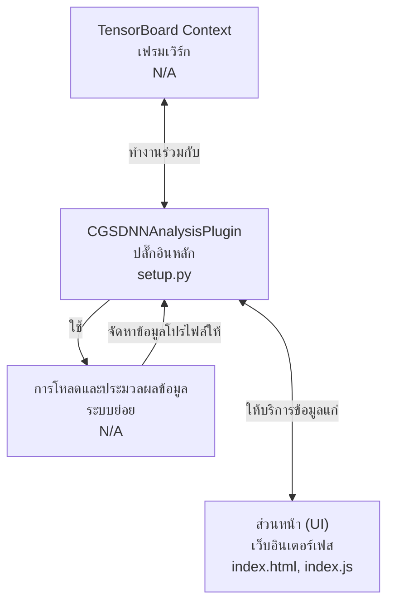

# เอกสารประกอบโค้ดเบส CGS-DNN Analysis Plugin

เอกสารนี้ให้ภาพรวมที่ครอบคลุมของโค้ดเบส `tensorboard-plugin-cgs-dnn-analysis` ซึ่งเป็นปลั๊กอินโปรไฟล์เลอร์แบบมินิมอลที่ออกแบบมาเพื่อแสดงและวิเคราะห์ Operator Trees ภายใน TensorBoard

## สถาปัตยกรรมระดับสูง (High-Level Architecture)



**CGS-DNN Analysis Plugin** ([setup.py](setup.py)) ทำงานร่วมกับ TensorBoard เพื่อสร้างภาพและวิเคราะห์ข้อมูลโปรไฟล์ของโครงข่ายประสาทเทียมลึก (DNN) โดยเน้นเฉพาะที่ Operator Trees และลักษณะการทำงานของมัน ระบบทำงานโดยการโหลดข้อมูลการติดตามผลดิบ (Chrome Trace format) ประมวลผลข้อมูลเหล่านั้นให้เป็น Operator Trees ที่มีโครงสร้าง จากนั้นจึงให้บริการข้อมูลนี้ไปยังส่วนหน้าบนเว็บเพื่อการแสดงผลแบบโต้ตอบ

ส่วนประกอบหลักและความสัมพันธ์มีดังนี้:

*   **`CGSDNNAnalysisPlugin`**: ปลั๊กอินหลักของ TensorBoard ที่รับผิดชอบในการจัดการวงจรชีวิตของข้อมูลโปรไฟล์, การจัดการการโหลดข้อมูล, การแคช, และการเปิดเผย API endpoints สำหรับส่วนหน้า
*   **ระบบย่อยการโหลดและประมวลผลข้อมูล (Data Loading & Processing Subsystem)**: ระบบที่ทำงานแบบหลายเธรด/หลายโปรเซส ซึ่งค้นหา profiling runs ใหม่, โหลดไฟล์ trace ดิบ, และแปลงไฟล์เหล่านั้นเป็น `RunProfile` ที่มีโครงสร้างและต่อมาเป็น Operator Trees
*   **ส่วนหน้า (Static Assets)**: ส่วนติดต่อผู้ใช้บนเว็บที่สร้างด้วย HTML และ JavaScript ซึ่งใช้ข้อมูลจาก API endpoints ของปลั๊กอินเพื่อแสดงผล Operator Trees และ Execution DAGs

```
+---------------------+       +-------------------------+       +-------------------+
|  TensorBoard Context| <---> | CGSDNNAnalysisPlugin    | <---> |   ส่วนหน้า (UI)    |
+---------------------+       |                         |       | (index.html,      |
                               | - ตรวจสอบ logdir        |       |  index.js)        |
                               | - จัดการอ็อบเจ็กต์ Run    |       +-------------------+
                               | - แคช Operator Trees    |
                               | - เปิดเผย API Endpoints  |
                               +-----------^-------------+
                                           |
                                           | (ข้อมูลโปรไฟล์)
                                           |
                               +-----------v-------------+
                               | การโหลดและประมวลผลข้อมูล |
                               | - RunLoader             |
                               | - RunProfile            |
                               | - OpTreeBuilder         |
                               | - StepDataCollector     |
                               +-------------------------+
```

## ส่วนประกอบและการโต้ตอบระดับกลาง (Mid-Level Components and Interactions)


### **`CGSDNNAnalysisPlugin`**

`CGSDNNAnalysisPlugin` ([cgs_dnn_analysis/plugin.py](cgs_dnn_analysis/plugin.py)) เป็นตัวประสานงานกลางของปลั๊กอิน

*   **วัตถุประสงค์**: เพื่อจัดเตรียมอินเทอร์เฟซของ TensorBoard สำหรับการวิเคราะห์ DNN รวมถึงการโหลด, ประมวลผล, และให้บริการข้อมูลโปรไฟล์
*   **ส่วนประกอบภายใน**:
    *   `logdir`: ไดเรกทอรีที่ถูกตรวจสอบเพื่อหาข้อมูลโปรไฟล์
    *   `_runs`: `OrderedDict` ที่ทำหน้าที่แคชอ็อบเจ็กต์ `Run` ซึ่งแทนเซสชันโปรไฟล์ที่โหลดแล้ว
    *   `_operator_trees`: ดิกชันนารีที่แคช Operator Trees ที่ประมวลผลแล้วสำหรับแต่ละ run และ worker
    *   `_cache`: อินสแตนซ์ของ `io.Cache` สำหรับจัดการไฟล์ชั่วคราว
    *   เธรด `_monitor_runs`: สแกน `logdir` อย่างต่อเนื่องเพื่อหา profiling runs ใหม่ ([cgs_dnn_analysis/plugin.py:200](cgs_dnn_analysis/plugin.py:200))
    *   เธรด `_receive_runs`: ประมวลผลอ็อบเจ็กต์ `Run` จากคิว, สร้างและแคช Operator Trees ([cgs_dnn_analysis/plugin.py:214](cgs_dnn_analysis/plugin.py:214))
*   **ความสัมพันธ์ภายนอก**:
    *   มีปฏิสัมพันธ์กับ TensorBoard context (`base_plugin.TBContext`)
    *   ให้บริการไฟล์ส่วนหน้าแบบสแตติก (`index.html`, `index.js`) ผ่าน `static_file_route` ([cgs_dnn_analysis/plugin.py:169](cgs_dnn_analysis/plugin.py:169))
    *   เปิดเผย API endpoints หลายตัวสำหรับส่วนหน้าผ่าน `get_plugin_apps` ([cgs_dnn_analysis/plugin.py:69](cgs_dnn_analysis/plugin.py:69)):
        *   `/runs`: ให้รายการของ profiling runs ที่มีอยู่
        *   `/workers`: แสดงรายการ workers สำหรับ run ที่กำหนด
        *   `/runtime`: ส่ง Operator Tree ที่ประมวลผลแล้วสำหรับ run และ worker ที่ระบุ พร้อมชื่อที่สวยงามและเวลาที่ปรับให้เป็นมาตรฐาน ([cgs_dnn_analysis/plugin.py:94](cgs_dnn_analysis/plugin.py:94))
        *   `/dag`: สร้างและส่งคืนการแสดงผลแบบ Directed Acyclic Graph (DAG) ของ Operator Tree โดยจัดหมวดหมู่โหนดเป็นการคำนวณหรือการสื่อสาร ([cgs_dnn_analysis/plugin.py:129](cgs_dnn_analysis/plugin.py:129))
        *   `/all_operator_trees`: ส่งคืน Operator Trees ทั้งหมดที่แคชไว้
        *   `/communication_timing`: ให้ข้อมูลเวลาการสื่อสารโดยเฉลี่ยข้าม runs

### **ระบบย่อยการโหลดและประมวลผลข้อมูล (Data Loading & Processing Subsystem)**

ระบบย่อยนี้รับผิดชอบในการนำไฟล์ Chrome Trace ดิบมาแปลงเป็นรูปแบบที่มีโครงสร้างซึ่งเหมาะสำหรับการวิเคราะห์และการแสดงผล

#### **`RunLoader`**

*   **วัตถุประสงค์**: เพื่อโหลดข้อมูลโปรไฟล์ดิบจากไดเรกทอรีของ run และเริ่มต้นการประมวลผลของ worker traces แต่ละรายการ
*   **ที่ตั้ง**: [cgs_dnn_analysis/profiler/loader.py](cgs_dnn_analysis/profiler/loader.py)
*   **ส่วนประกอบภายใน**:
    *   `run_name`, `run_dir`: ตัวระบุสำหรับ profiling run
    *   `caches`: อินสแตนซ์ของ `io.Cache` สำหรับจัดการสำเนาของไฟล์ระยะไกลในเครื่อง
    *   `queue`: `multiprocessing.Queue` ที่ใช้รับอ็อบเจ็กต์ `RunProfile` ที่ประมวลผลแล้วจากโปรเซสลูก
*   **ความสัมพันธ์ภายนอก**:
    *   ถูกค้นพบและเรียกใช้โดยเมธอด `_load_run` ของ `CGSDNNAnalysisPlugin` ([cgs_dnn_analysis/plugin.py:225](cgs_dnn_analysis/plugin.py:225))
    *   สร้างอินสแตนซ์ของ `multiprocessing.Process` ลูก (ผ่าน `_process_data` ([cgs_dnn_analysis/profiler/loader.py:50](cgs_dnn_analysis/profiler/loader.py:50))) เพื่อแยกวิเคราะห์ไฟล์ trace ของ worker แต่ละตัว
    *   รับอ็อบเจ็กต์ `RunProfile` จากโปรเซสลูกเหล่านี้ผ่านคิวภายใน

#### **`RunProfile`**

*   **วัตถุประสงค์**: แทนข้อมูลโปรไฟล์สำหรับ worker ที่ระบุภายใน run หนึ่งๆ ประกอบด้วย Operator Tree ดิบและเมธอดในการประมวลผล
*   **ที่ตั้ง**: [cgs_dnn_analysis/run.py](cgs_dnn_analysis/run.py)
*   **ส่วนประกอบภายใน**:
    *   `worker`: ชื่อของ worker
    *   `span`: (อาจมี) ช่วงเวลาสำหรับโปรไฟล์
    *   `tid2tree`: ดิกชันนารีที่แมป Thread IDs กับ `OperatorNode` trees ของแต่ละเธรด
*   **ความสัมพันธ์ภายนอก**:
    *   สร้างโดย `RunGenerator` (โดยนัย, เนื่องจาก `RunLoader` ใช้ `generator.generate_run_profile()`)
    *   ถูกเพิ่มไปยังอ็อบเจ็กต์ `Run` ผ่าน `run.add_profile` ([cgs_dnn_analysis/run.py:149](cgs_dnn_analysis/run.py:149))
    *   เมธอด `get_operator_tree()` ของมันถูกเรียกโดย `CGSDNNAnalysisPlugin` เพื่อดึง Operator Tree ที่ประมวลผลแล้วมาแคช ([cgs_dnn_analysis/plugin.py:239](cgs_dnn_analysis/plugin.py:239))

#### **`OpTreeBuilder`**

*   **วัตถุประสงค์**: เพื่อสร้าง Operator Tree แบบลำดับชั้นจาก profiling events ดิบ จัดการการซ้อนกันของ operations และเชื่อมโยง forward และ backward passes
*   **ที่ตั้ง**: [cgs_dnn_analysis/profiler/op_tree.py](cgs_dnn_analysis/profiler/op_tree.py)
*   **ส่วนประกอบภายใน**:
    *   `main_tid`: Thread ID ที่ระบุว่าเป็นเธรดหลัก
    *   `tid2tree`: ดิกชันนารีผลลัพธ์ของ Operator Trees โดยมี key เป็น Thread ID
    *   `_build_tree_internal`: ตรรกะหลักแบบเรียกซ้ำสำหรับสร้างโครงสร้าง tree ตามเวลาเริ่มต้นและสิ้นสุดของ event ([cgs_dnn_analysis/profiler/op_tree.py:100](cgs_dnn_analysis/profiler/op_tree.py:100))
    *   `_remove_dup_nodes`: รวม operations ที่เหมือนกันและต่อเนื่องกันใน tree ([cgs_dnn_analysis/profiler/op_tree.py:150](cgs_dnn_analysis/profiler/op_tree.py:150))
*   **ความสัมพันธ์ภายนอก**:
    *   ใช้โดย `RunProfile.get_operator_tree()` (โดยนัย, เนื่องจาก `RunProfile` ประมวลผลข้อมูล `tid2tree`)

#### **`StepDataCollector`**

*   **วัตถุประสงค์**: เพื่อดึงและจัดระเบียบข้อมูลการดำเนินงานที่เฉพาะเจาะจง (forward, backward, loss, optimizer, communication) จาก Operator Tree ดิบให้อยู่ในโครงสร้างแบบต่อ step
*   **ที่ตั้ง**: [cgs_dnn_analysis/run.py](cgs_dnn_analysis/run.py)
*   **ส่วนประกอบภายใน**:
    *   `steps_data`: ดิกชันนารีที่เก็บข้อมูลที่ดึงออกมา โดยมี key เป็นหมายเลข step
    *   `extract_step_number`: ดึงหมายเลข step จากชื่อ profiler step ([cgs_dnn_analysis/run.py:57](cgs_dnn_analysis/run.py:57))
    *   `is_operation`, `find_operation`: เมธอดช่วยในการระบุประเภทของ operations ที่เฉพาะเจาะจงภายใน tree
    *   `process_main_thread`, `process_backward_and_optimizer`, `process_communication`: เมธอดสำหรับเติมข้อมูลใน `steps_data` โดยการสำรวจ Operator Tree และระบุ events ที่เกี่ยวข้อง ([cgs_dnn_analysis/run.py:77](cgs_dnn_analysis/run.py:77), [cgs_dnn_analysis/run.py:90](cgs_dnn_analysis/run.py:90), [cgs_dnn_analysis/run.py:100](cgs_dnn_analysis/run.py:100))
*   **ความสัมพันธ์ภายนอก**:
    *   ถูกสร้างและใช้ภายใน `RunProfile.get_operator_tree()` ([cgs_dnn_analysis/run.py:160](cgs_dnn_analysis/run.py:160)) เพื่อจัดโครงสร้างข้อมูลโปรไฟล์

## รายละเอียดการใช้งานระดับล่าง (Low-Level Implementation Details)

```mermaid
graph TB
  runProfileGetOpTree["RunProfile.get_operator_tree()<br>เมธอด<br>cgs_dnn_analysis/run.py:160"]
  stepDataCollector["StepDataCollector<br>คลาส<br>cgs_dnn_analysis/run.py:166"]
  tid2tree["tid2tree<br>ดิกชันนารี<br>N/A"]
  prepareBackward["prepare_backward_data()<br>ฟังก์ชัน<br>cgs_dnn_analysis/run.py:129"]
  filterBackward["filter_backward_data()<br>ฟังก์ชัน<br>cgs_dnn_analysis/run.py:139"]
  prepareForwardLoss["prepare_forward_and_loss_data()<br>ฟังก์ชัน<br>cgs_dnn_analysis/run.py:190"]
  trimSortOps["trim_and_sort_operations()<br>ฟังก์ชัน<br>cgs_dnn_analysis/run.py:220"]
  dagRoute["CGSDNNAnalysisPlugin.dag_route()<br>เมธอด<br>cgs_dnn_analysis/plugin.py:129"]
  opTreesCache["_operator_trees<br>แคช<br>N/A"]
  prettifyName["prettify_name()<br>ฟังก์ชัน<br>cgs_dnn_analysis/plugin.py:149"]
  timeNormalization["การปรับเวลามาตรฐาน<br>กระบวนการ<br>cgs_dnn_analysis/plugin.py:200"]
  nodeEdgeCreation["การสร้างโหนดและเส้นเชื่อม<br>กระบวนการ<br>N/A"]
  commTimingRoute["CGSDNNAnalysisPlugin.communication_timing_route()<br>เมธอด<br>cgs_dnn_analysis/plugin.py:270"]
  dataAggregation["การรวบรวมข้อมูล<br>กระบวนการ<br>N/A"]
  durationExtraction["การดึงระยะเวลา<br>กระบวนการ<br>N/A"]
  averaging["การหาค่าเฉลี่ย<br>กระบวนการ<br>N/A"]

  runProfileGetOpTree --> |"สร้าง"| stepDataCollector
  runProfileGetOpTree --> |"วนซ้ำใน"| tid2tree
  runProfileGetOpTree --> |"เรียก"| prepareBackward
  prepareBackward --> |"เรียก"| filterBackward
  runProfileGetOpTree --> |"เรียก"| prepareForwardLoss
  runProfileGetOpTree --> |"เรียก"| trimSortOps

  dagRoute --> |"ดึงข้อมูลจาก"| opTreesCache
  dagRoute --> |"ใช้"| prettifyName
  dagRoute --> |"ดำเนินการ"| timeNormalization
  dagRoute --> |"ดำเนินการ"| nodeEdgeCreation

  commTimingRoute --> |"ดึงข้อมูลจาก"| opTreesCache
  commTimingRoute --> |"ดำเนินการ"| dataAggregation
  commTimingRoute --> |"ดำเนินการ"| durationExtraction
  commTimingRoute --> |"ดำเนินการ"| averaging
```



### **การประมวลผล Operator Tree ใน `RunProfile.get_operator_tree()`**

เมธอด `get_operator_tree` ใน `RunProfile` ([cgs_dnn_analysis/run.py:160](cgs_dnn_analysis/run.py:160)) จัดการการแปลง profiling events ดิบให้เป็น Operator Tree ที่มีโครงสร้างและสามารถวิเคราะห์ได้

1.  **การรวบรวมข้อมูล**: เริ่มต้น `StepDataCollector` ([cgs_dnn_analysis/run.py:166](cgs_dnn_analysis/run.py:166)) และวนซ้ำใน `tid2tree` (Operator Trees ของแต่ละเธรด) เพื่อเติมข้อมูลลงใน `steps_data` ของ collector ซึ่งเกี่ยวข้องกับการระบุเธรดหลัก, เธรด backward, และ communication events
2.  **การเตรียมข้อมูล Backward**: ฟังก์ชัน `prepare_backward_data` ([cgs_dnn_analysis/run.py:129](cgs_dnn_analysis/run.py:129)) ดึงข้อมูล children ที่เกี่ยวข้องจากโหนด backward `filter_backward_data` ([cgs_dnn_analysis/run.py:139](cgs_dnn_analysis/run.py:139)) ปรับปรุงข้อมูล backward เพิ่มเติม โดยเฉพาะการมองหา operations `nccl:all_reduce`
3.  **การเตรียมข้อมูล Forward และ Loss**: `prepare_forward_and_loss_data` ([cgs_dnn_analysis/run.py:190](cgs_dnn_analysis/run.py:190)) ทำความสะอาดชื่อและเชื่อมโยง forward passes กับ backward passes ที่สอดคล้องกัน
4.  **การตัดแต่งและเรียงลำดับ**: `trim_and_sort_operations` ([cgs_dnn_analysis/run.py:220](cgs_dnn_analysis/run.py:220)) ประมวลผลข้อมูลที่ดึงออกมา, แปลง timestamps เป็นมิลลิวินาที, คำนวณระยะเวลา, กำหนดหมวดหมู่ (computation/communication), และเรียงลำดับ operations ตามเวลาเริ่มต้น

### **การสร้าง DAG ใน `CGSDNNAnalysisPlugin.dag_route()`**

เมธอด `dag_route` ([cgs_dnn_analysis/plugin.py:129](cgs_dnn_analysis/plugin.py:129)) สร้างการแสดงผลแบบ DAG ของ Operator Tree แบบไดนามิกเพื่อการแสดงผล

1.  **การดึงข้อมูล**: ดึง Operator Tree ที่ประมวลผลล่วงหน้าแล้วจากแคช `_operator_trees`
2.  **การทำให้ชื่อสวยงาม**: ใช้ `prettify_name` ([cgs_dnn_analysis/plugin.py:149](cgs_dnn_analysis/plugin.py:149)) เพื่อทำให้ชื่อ operator อ่านง่ายขึ้น (เช่น การลบคำนำหน้า `nn.Module:`)
3.  **การปรับเวลามาตรฐาน**: ปรับเวลาของ event ภายในแต่ละ step ให้อยู่ในสเกล 0-10 เพื่อการแสดงผลที่สอดคล้องกัน ([cgs_dnn_analysis/plugin.py:200](cgs_dnn_analysis/plugin.py:200))
4.  **การสร้างโหนดและเส้นเชื่อม**: วนซ้ำใน steps ของ Operator Tree เพื่อสร้างโหนด (computation และ communication) และเส้นเชื่อม (แทนความสัมพันธ์) สำหรับ DAG
    *   **โหนด Computation**: สร้างขึ้นสำหรับ operations forward, loss, backward, และ optimizer
    *   **โหนด Communication**: จัดกลุ่มสำหรับ `nccl:broadcast` (ต่อ step) และ `nccl:all_reduce` (ต่อ backward pass)
    *   **เส้นเชื่อม**: กำหนดตามลำดับการทำงาน (เช่น forward -> forward, loss -> backward) และความสัมพันธ์ของการสื่อสาร (เช่น broadcast -> first forward, backward -> all_reduce)

### **การวิเคราะห์เวลาการสื่อสารใน `CGSDNNAnalysisPlugin.communication_timing_route()`**

เมธอด `communication_timing_route` ([cgs_dnn_analysis/plugin.py:270](cgs_dnn_analysis/plugin.py:270)) วิเคราะห์ overhead ของการสื่อสาร

1.  **การรวบรวมข้อมูล**: ดึง Operator Trees ทั้งหมดที่แคชไว้
2.  **การดึงระยะเวลา**: วนซ้ำในแต่ละ run, worker, และ step เพื่อดึงระยะเวลาสำหรับ operations `broadcast` และ `all_reduce`
3.  **การหาค่าเฉลี่ย**: คำนวณระยะเวลาเฉลี่ยสำหรับแต่ละ communication event ที่ระบุข้ามการปรากฏทั้งหมดภายใน run หนึ่งๆ
4.  **ผลลัพธ์**: ส่งคืนอ็อบเจ็กต์ JSON ที่มีเวลาการสื่อสารโดยเฉลี่ยต่อ run

---
*สร้างโดย [CodeViz.ai](https://codeviz.ai) ณ วันที่ 14/8/2568 07:09:34*
